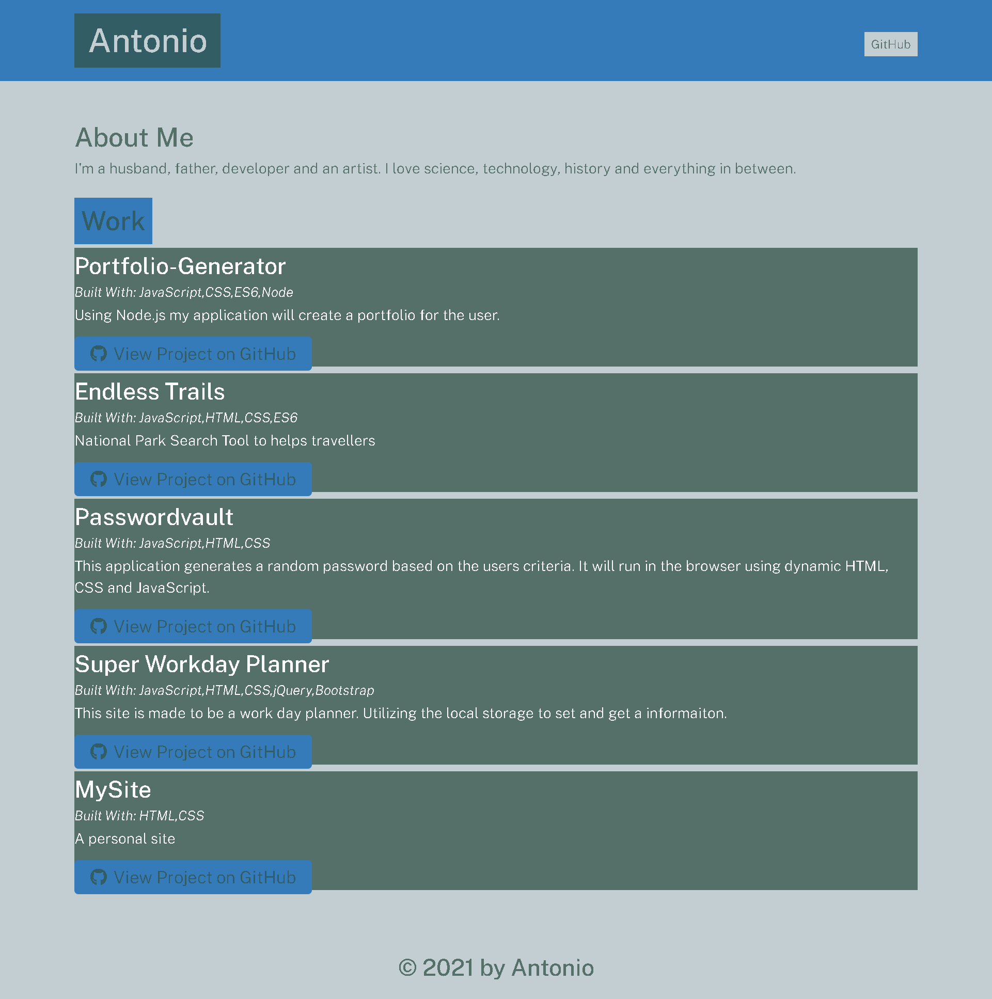

# Node.Js-Portfolio-Generator, READMe
  
  
  
  ## Descriptions
  Using Node to dynamically generate a portfolio after the users input.
  

  ## Table of Contents
  - [Description](#description)
  - [GitHub](#github)
  - [Usage](#usage)
  - [Installation](#installation)
  - [License](#license)
  - [Contact](#contact)
  
  ## GitHub
  https://github.com/Tonycodesnow/portfolio-generator
  

  
  ## Usage
  Use npm (Node Package Manager) to initialize a project and install and import Node.js modules and use in a terminal.

  
  ## Installation
  Command-line, Npm, the Node.js standard library, Inquirer, & a Ide like Atom or VScode. 
  
  ## License 
  This project is covered under the mit [License](https://choosealicense.com/licenses/mit)
  
  ## Contact
  Find me on GitHub [https://github.com/Tonycodesnow/portfolio-generator](https://github.com/https://github.com/Tonycodesnow/portfolio-generator)  or E-mail me: toni.huertinez@gmail.com